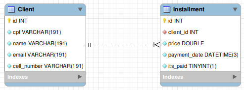

# Softeo Tecnologia - Backend

Bem vindo(a). Este repositório contém o histórico de desenvolvimento da parte backend do teste técnico da empresa `Softeo Tecnologia`. Para acompanhar o deploy, clique [aqui](https://softeo-rodrigolimajesus.herokuapp.com/). Mas antes confira abaixo instruções importantes para o uso do projeto, bem como as rotas disponíveis na nossa API.

## Importante!

Os servidores do Heroku, onde nosso banco de dados está hospedado, podem demorar para responder a sua primeira requisição, pois para economia de dados os servidores ficam inativos até que alguém o acesse novamente, por isso, ao acessar a API pela primeira vez depois de algum tempo, por favor, aguarde.

## Para rodar o projeto na sua máquina:

1. Clone o projeto

- `git clone git@github.com:RodrigoLimaJesus/softeo-backend.git`

2. Acesse o diretório criado

- `cd softeo-backend`

3. Instale as dependências

- `npm install`

4. Coloque o projeto para rodar

- `npm start`

Obs: Você também pode optar por rodar o projeto como ambiente de desenvolvimento, basta usar `npm run dev`

## Estrutura do banco de dados

O banco de dados é composto por duas tabelas, a `Client` e a `Installment`, e é composto pela seguinte estrutura



## Rotas disponíveis

- Listar todos os clientes

  ```javascript
  // Url: https://softeo-rodrigolimajesus.herokuapp.com/client/all
  // Método: GET
  // Retorno esperado:
  [
    {
      id: number,
      cpf: string,
      name: string,
      email: string,
      cellNumber: string,
      // installments: um array contendo as parcelas do cliente
    },
    {
      id: number,
      cpf: string,
      name: string,
      email: string,
      cellNumber: string,
      // installments: um array contendo as parcelas do cliente
    },
    ...
  ];
  ```

- Buscar um cliente pelo id

  ```javascript
  // Url: https://softeo-rodrigolimajesus.herokuapp.com/client/:id
  // Método: GET
  // Retorno esperado:
  {
    id: number,
    cpf: string,
    name: string,
    email: string,
    cellNumber: string,
    // installments: um array contendo as parcelas do cliente
  }
  ```

- Criar um cliente

  ```javascript
  // Url: https://softeo-rodrigolimajesus.herokuapp.com/client/create
  // Método: POST
  // Corpo da requisição:
  {
    cpf: string,
    name: string,
    email: string,
    cellNumber: string,
  }
  // Retorno esperado:
  {
    id: number,
    cpf: string,
    name: string,
    email: string,
    cellNumber: string,
  }
  ```

- Listar todas as parcelas

  ```javascript
  // Url: https://softeo-rodrigolimajesus.herokuapp.com/installment/all
  // Método: GET
  // Retorno esperado:
  [
    {
      id: number,
      clientId: number,
      price: number,
      paymentDate: string (date),
      itsPaid: boolean,
    },
    {
      id: number,
      clientId: number,
      price: number,
      paymentDate: string (date),
      itsPaid: boolean,
    },
    ...
  ];
  ```

- Listar todas as parcelas

  ```javascript
  // Url: https://softeo-rodrigolimajesus.herokuapp.com/installment/all
  // Método: GET
  // Retorno esperado:
  [
    {
      id: number,
      clientId: number,
      price: number,
      paymentDate: string (date),
      itsPaid: boolean,
    },
    {
      id: number,
      clientId: number,
      price: number,
      paymentDate: string (date),
      itsPaid: boolean,
    },
    ...
  ];
  ```

  - Filtrar as parcelas por data

  `Obs: startDate e endDate são opcionais, e podem ser usados individualmente`

  ```javascript
  // Url: https://softeo-rodrigolimajesus.herokuapp.com/installment/all?startDate=YYYY/MM/DD?endDate=YYYY/MM/AA
  // Método: GET
  // Retorno esperado:
  [
    {
      id: number,
      clientId: number,
      price: number,
      paymentDate: string (date),
      itsPaid: boolean,
    },
    {
      id: number,
      clientId: number,
      price: number,
      paymentDate: string (date),
      itsPaid: boolean,
    },
    ...
  ];
  ```

  - Atualizar o status de pagamento de uma parcela

  ```javascript
  // Url: https://softeo-rodrigolimajesus.herokuapp.com/installment?id=1&status=true
  // Método: GET
  // Retorno esperado:
  {
    id: number,
    clientId: number,
    price: number,
    paymentDate: string (date),
    itsPaid: boolean,
  },
  ```

  - Atualizar o status de pagamento de uma parcela

  ```javascript
  // Url: https://softeo-rodrigolimajesus.herokuapp.com/installment/create
  // Método: GET
  // Corpo da requisição:
  {
    clientId: number,
    price: number,
    quantity: number,
    intervalDay: number,
    startDate: string (date)
  }
  // Retorno esperado:
  {
    count: number // indica quantos itens foram inseridos na tabela
  },
  ```
